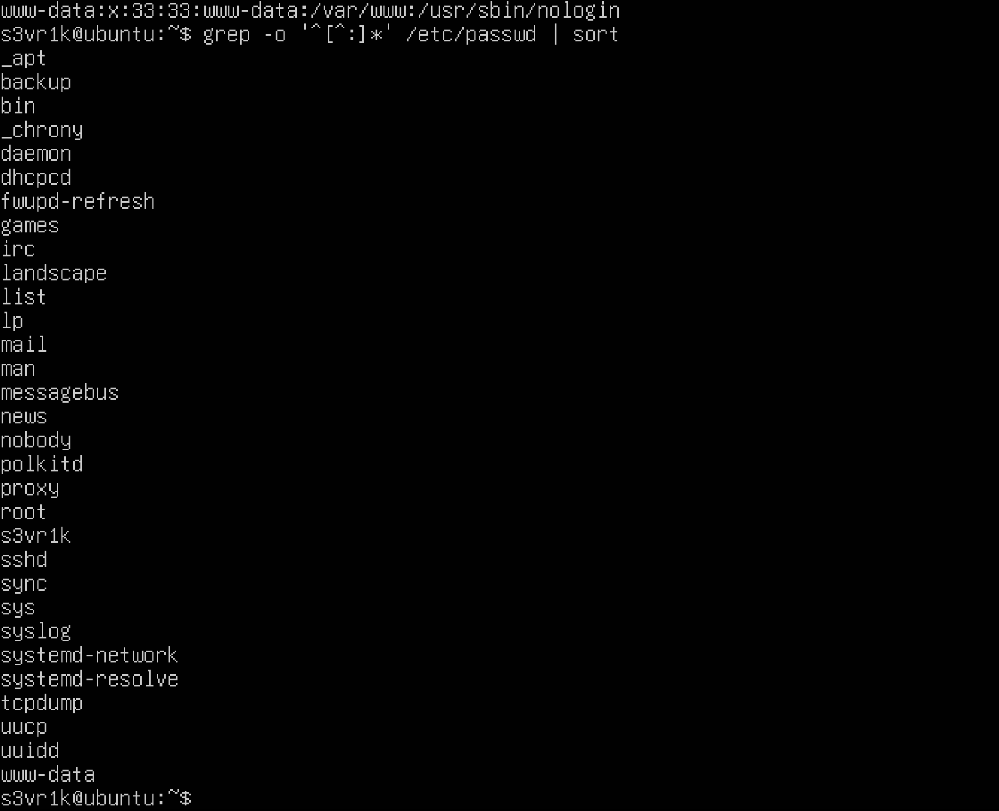
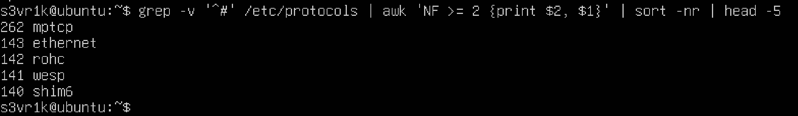
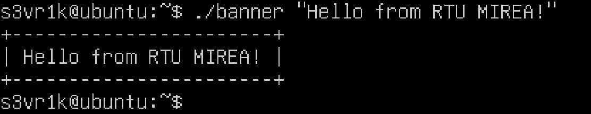
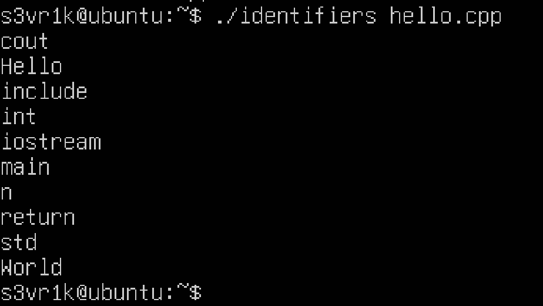
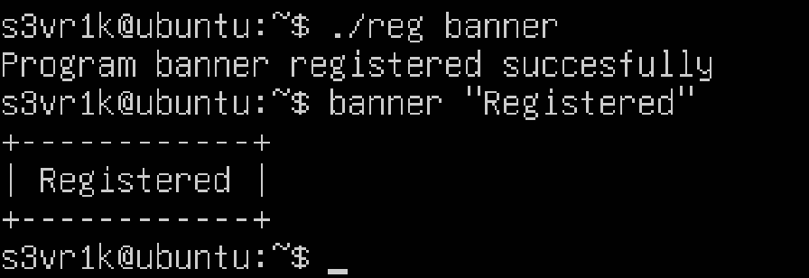
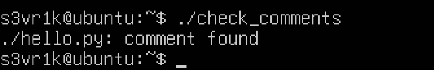
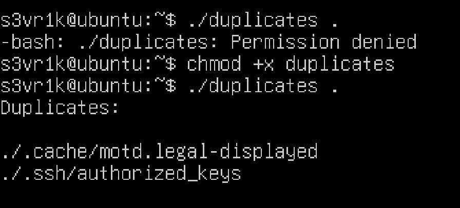
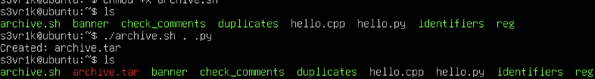
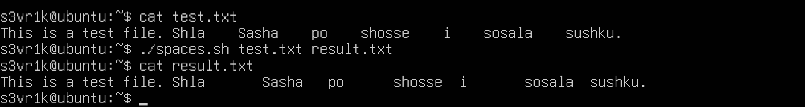
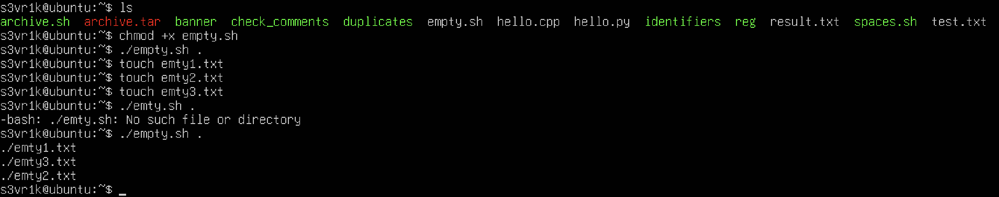

# Практическая работа 1

## Задание 1

Вывести отсортированный в алфавитном порядке список имен пользователей в файле passwd (вам понадобится grep).

```bash
grep '^[^:]*' /etc/passwd | sort
```


## Задание 2

Вывести данные /etc/protocols в отформатированном и отсортированном порядке для 5 наибольших портов, как показано в примере ниже:

```bash
grep -v '^#' /etc/protocols | awk 'NF >= 2 {print $2, $1}' | sort -nr | head -5
```


## Задание 3

Написать программу banner средствами bash для вывода текстов, как в следующем примере (размер баннера должен меняться!):

```bash
#!/bin/bash

text="$*"
length=${#text}

printf '+'
printf '%*s' "$((length + 2))" '' | tr ' ' '-'
printf '+\n'

printf '| %s |\n' "$text"

printf '+'
printf '%*s' "$((length + 2))" '' | tr ' ' '-'
printf '+\n'
```


## Задание 4

Написать программу для вывода всех идентификаторов (по правилам C/C++ или Java) в файле (без повторений).

Содержимое файла hello.cpp:
```C++
#include <iostream>

int main() {
    std::cout << "Hello World!\n";
    return 0;
}
```
identifiers:
```bash
#!/bin/bash

grep -oE '[A-Za-z_][A-Za-z0-9_]*' "$1" | sort -u
```


## Задание 5

Написать программу для регистрации пользовательской команды (правильные права доступа и копирование в /usr/local/bin).

Например, пусть программа называется reg:

```
./reg banner
```

В результате для banner задаются правильные права доступа и сам banner копируется в /usr/local/bin.

```bash
#!/bin/bash

if [ "$#" -ne 1 ]; then
    echo "Usage: $0 program"
    exit 1
fi

program="$1"

if [ ! -f "$program" ]; then
    echo "File not found: $program"
    exit 1
fi

chmod +x "$program"
sudo cp "$program" /usr/local/bin/

echo "Program $(basename "$program") registered succesfully"
```


## Задание 6

Написать программу для проверки наличия комментария в первой строке файлов с расширением c, js и py.

```bash
#!/bin/bash

find . -type f \( -name "*.c" -o -name "*.js" -o name "*.py" \) | while IFS= read -r file
do
    first_line=$(head -n 1 "$file")

    case "$file" in
        *.py)
            if [[ "$first_line" == \#* ]]; then
                echo "$file: comment found"
            else
                echo "$file: no comment"
            fi
            ;;
        *.c|*.js)
            if [[ "$first_line" == //* || "first_line" == \/* ]]; then
                echo "$file: comment found"
            else
                echo "$file: no comment"
            fi
            ;;
    esac
done
```


## Задание 7

Написать программу для нахождения файлов-дубликатов (имеющих 1 или более копий содержимого) по заданному пути (и подкаталогам).

```bash
#!/bin/bash

if [ "$#" -ne 1 ]; then
    echo "Usage: $0 directory"
    exit 1
fi

find "$1" -type f -exec shasum -a 256 {} \; |
    sort |
    awk '
    {
        hash = $1
        file = substr($0, index($0, $2))
        files[hash] = files[hash] "\n" file
        count[hash]++
    }
    END {
        for (hash in count) {
            if (count[hash] > 1) {
                print "Duplicates:"
                print files[hash]
                print ""
            }
        }
    }'
```


## Задание 8

Написать программу, которая находит все файлы в данном каталоге с расширением, указанным в качестве аргумента и архивирует все эти файлы в архив tar.

```bash
#!/bin/bash

if [ "$#" -ne 2 ]; then
    echo "Usage: $0 directory extension"
    exit 1
fi

directory="$1"
extension="$2"
archive="archive.tar"

find "$directory" -type f -name "*.$extension" -print0 |
    tar --null -T - -cf "$archive"

echo "Created: $archive"
```


## Задание 9

Написать программу, которая заменяет в файле последовательности из 4 пробелов на символ табуляции. Входной и выходной файлы задаются аргументами.

Тестовый файл содержит следующее:
```
This is a test file. Shla    Sasha    po    shosse    i    sosala    sushku.
```
Программа:
```bash
#!/bin/bash

if [ "$#" -ne 2 ]; then
    echo "Usage: $0 input_file output_file"
    exit 1
fi

sed 's/    /\t/g' "$1" > "$2"
```

Возможно, на скриншоте не заметно, но программа заменила необходимые пробелы на знак табуляции

## Задание 10

Написать программу, которая выводит названия всех пустых текстовых файлов в указанной директории. Директория передается в программу параметром. 

```bash
#!/bin/bash

if [ "$#" -ne 1 ]; then
    echo "Usage: $0 directory"
    exit 1
fi

find "$1" -type f -size 0 \( \
    -name "*.txt" -o \
    -name "*.text" \
\) -print
```
Для тестирования я создал 3 пустых текстовых файла.

